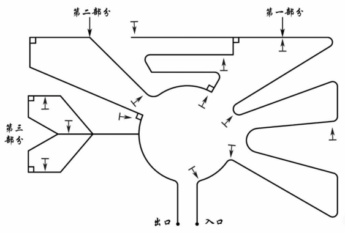
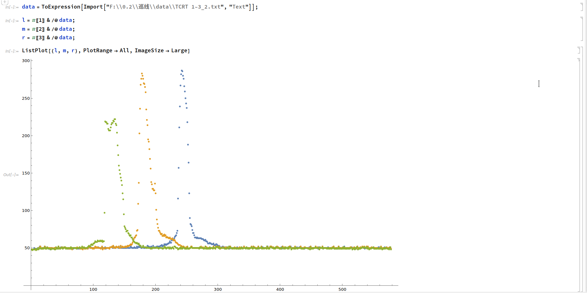
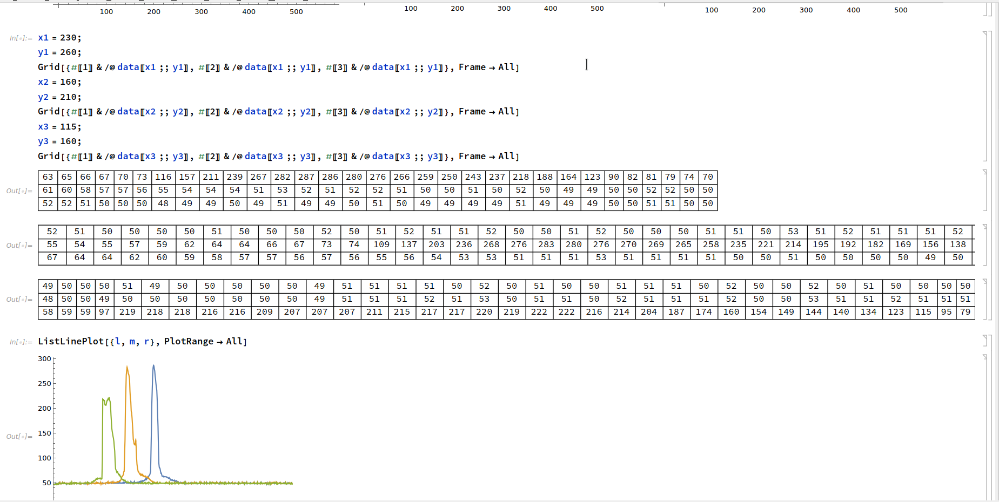
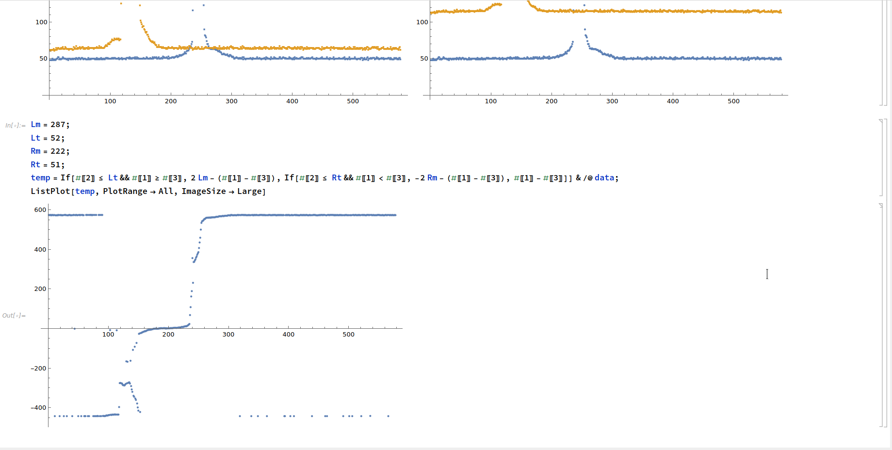

## 简介

我2020年11月大二时，参加学校里科技社组织的机器人大赛（**智能小车巡线大赛**）提交的代码。使用的单片机是Arduino Uno。

当时还没学面对对象，所以是按C语言面向过程的风格开发的。

当然，现在看来代码写得不太好，功能划分不是太合理，纯过程化的开发也增加了复杂度。不过对于当时刚入学1年，没什么开发经验的学生来说大概还算可以的？

总之，通过比赛了解了Arduino这种开发板的使用以及PID控制算法，也亲身实践了从拧螺丝、插面包板到设计、实现、调试代码，再到看见自己的软硬件在赛道上成功运行的全过程，还是很有趣的。

### 比赛规则

自己组装小车，在由黑色电工胶布贴成的路线上巡线，这条线上设置了一些顺序得分点和附加得分点。路线可以有转弯，可以有多个分叉，可以有环。例如这样：

小车从指定的起点开始巡线，按到达终点或者脱离路线时经过的得分点的个数算分，其中顺序得分点需要依次通过，否则不算分。到达终点并在设置好的障碍物前停下时，获得时间分。

#### 限制：

- 单片机芯片必须用ATmega328
- 巡线传感器只能是红外线传感器，不能用可见光传感器和摄像头等
- 不能用计算机视觉的方法巡线
- 必须使用指定的电池
- 动力马达必须使用统一规定的两个减速电机JGB37-520
- 电机必须使用指定的电池供电，不能使用升压器

## 技术点

- 为了确定各个红外线传感器的值与小车所处位置的关系，用[Mathematica](https://www.wolfram.com/mathematica/)分析了传感器TCRT5000在路线内外各个位置的值（[截图](#mma)），最终确定了判断所处位置的阈值
- 不分叉路线的巡线使用离散PID控制算法
- 通过小车外侧对称的两个红外线传感器检测当前路线是否分叉，有多少数量的分叉

- 当遇到岔路时，使用深度优先搜索。用状态机决定从分叉返回时前进的方向，确保不会往回走
- DFS用到的栈是自己用链表实现的（不用预分配数组是因为内存很有限，代码量变化时可能要重新调整数组大小，不方便）
- 使用稳压器稳定电机的供电电压，保证电机速率不随电池电量改变，以达到较为精确的转弯效果

## 指标

- 可在约60～180度的不分叉路线上正常巡线，可在曲线上正常巡线
- 支持21层的嵌套分叉（栈可用的内存最多支持21个元素）
- 支持约90～180度的分叉
- 支持有1～2条岔路的分叉

- 速度大概20cm/s

## 方案

### 大致思路

传感器两边检测……PID……多分叉时深度优先搜索

### 使用的硬件

- 单片机：Arduino Uno × 1
- 巡线红外传感器：TCRT5000 × 5
- 红外避障传感器：E18-D80NK
- 减速电机：JGB37-520 × 2
- 电机驱动器：L298N × 1
- 电池：18650 3.7V锂电池 × 2
- 面包板和杜邦线一些

5个巡线红外传感器平行安装在小车前方

## 一些技术细节

### 小车偏离路线中心的距离和方向的确定

通过串口打印功能获取了中间三个TCRT5000在黑色电工胶布不同位置的值，用Mathematica分析，最后确定了判断小车所处位置的红外传感器值之差的阈值，实际运行效果不错（完整代码见[data/TCRT 1~3_2.nb](./data/TCRT 1~3_2.nb)）：

## 编译和运行

### 编译

Arduino Studio打开[src/](./src)文件夹，连接Uno并上传即可。

### 运行

面包板上把电池的阴极和阳极导通即可。

## License

MIT