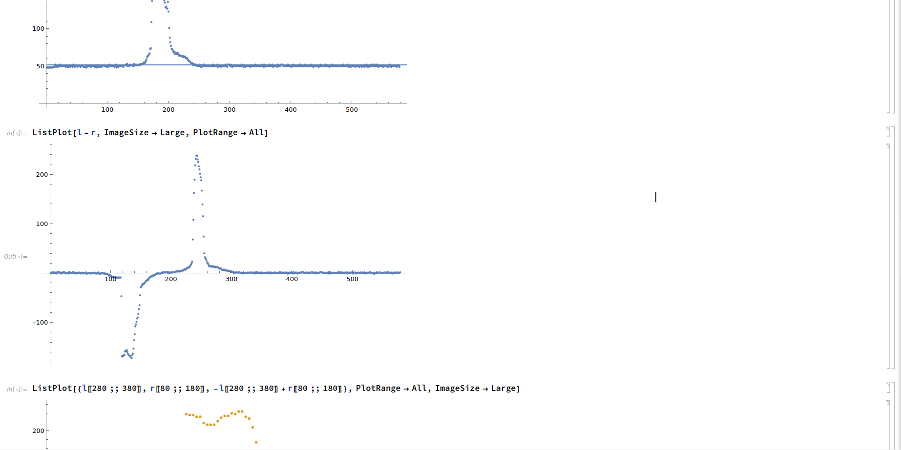

## 简介

我2020年11月大二时，参加学校里科技社组织的机器人大赛（**智能小车巡线大赛**）提交的代码。使用的单片机是Arduino Uno。

当时还没学面对对象，所以是按C语言面向过程的风格开发的。

当然，现在看来代码写得不太好，功能划分不是太合理，纯过程化的开发也增加了复杂度。不过对于当时刚入学1年，没什么开发经验的学生来说大概还算可以的？

总之，通过比赛了解了Arduino这种开发板的使用以及PID控制算法，也亲身实践了从拧螺丝、插面包板到设计、实现、调试代码，再到看见自己的软硬件在赛道上成功运行的全过程，还是很有趣的。

### 比赛规则

自己组装小车，在由黑色电工胶布贴成的路线上巡线，这条线上设置了一些顺序得分点和附加得分点。路线可以有转弯，可以有多个分叉，可以有环。例如这样：

小车从指定的起点开始巡线，按到达终点或者脱离路线时经过的得分点的个数算分，其中顺序得分点需要依次通过，否则不算分。到达终点并在设置好的障碍物前停下时，获得时间分。

#### 限制：

- 单片机芯片必须用ATmega328
- 巡线传感器只能是红外线传感器，不能用可见光传感器和摄像头等
- 不能用计算机视觉的方法巡线
- 必须使用指定的电池
- 动力马达必须使用统一规定的两个减速电机JGB37-520
- 电机必须使用指定的电池供电，不能使用升压器

## 技术点

- 为了获得关于与理想位置的偏离距离单调的值供PID算法使用，用[Mathematica](https://www.wolfram.com/mathematica/)分析了传感器TCRT5000的特性（[截图](#mma)），确定了从传感器的值生成可供PID算法使用的值的方法
- 不分叉路线的巡线使用离散PID
- 通过小车外侧对称的两个红外线传感器检测当前路线是否分叉，有多少数量的分叉

- 当遇到岔路时，使用深度优先搜索。用状态机决定从分叉返回时前进的方向，确保不会往回走
- DFS用到的栈是自己用链表实现的（不用预分配数组是因为内存很有限，代码量变化时可能要重新调整数组大小，不方便）
- 使用稳压器稳定电机的供电电压，保证电机速率不随电池电量改变，以达到较为精确的转弯效果

## 指标

- 可在约60～180度的不分叉路线上正常巡线，可在曲线上正常巡线
- 支持21层的嵌套分叉（栈可用的内存最多支持21个元素）
- 支持约90～180度的分叉
- 支持有1～2条岔路的分叉

- 速度大概20cm/s

## 方案

### 使用的硬件

- 单片机：Arduino Uno × 1
- 巡线红外传感器：TCRT5000 × 5
- 红外避障传感器：E18-D80NK
- 减速电机：JGB37-520 × 2
- 电机驱动器：L298N × 1
- 电池：18650 3.7V锂电池 × 2
- 面包板和杜邦线一些

### 大致思路

#### 传感器布置

小车前方贴近地面处平行放5个TCRT5000，中间3个是PID巡线传感器，外边2个用来检测道路分叉情况。

小车正上方固定一个D80NK，用于检测前方是否有障碍物。

#### PID控制法

- 为了用PID对小车进行控制，首先要获得度量小车偏离理想位置的距离和方向

- 只要这个度量沿偏离距离是单调的，就可以把它作为PID算法中的值，从而计算出effect
- 计算出effect后，对左右两个电机分别加上和减小effect的值，就达到了调节小车瞬时运动方向和速率的目的

可以对中间3个传感器的值进行一些处理，得到新的值，只要这个值是对偏移距离单调的，就可以投喂进PID算法。我的处理是[这样的](#mma)。

#### 分叉检测法

5个TCRT5000中，外侧2个是检测分叉的。当其中1个或者2个的值超过阈值后根据超过阈值的数量判断分叉数量。

只能检测1或2个分叉，但对于比较简单的地图来说够用了。

#### 转向法

事先实验，找出转动一定角度需要的大致时间。

因为在减速电机上使用了稳压器，运行过程中电机的电压变化很小，所以电机的转速也大致不变，转动的角度还算精确。

#### 岔路遍历法

DFS

细节待补充

## misc

### 从三个PID传感器的值生成对偏移距离单调的新值

（完整代码在[data/TCRT 1~3_2.nb]("./data/TCRT 1~3_2.nb")）

首先观察中间三个TCRT5000在电工胶布内外各个位置的值：

直接将两侧的传感器值相减得到的是不单调的函数，无法用于PID算法：

找出两侧传感器峰值的位置以后，把这个区间之外的抹平，得到近似单调的函数，并且将峰值放大一倍使被抹平的部分更明显：

左半部分明显不单调是因为这时三个传感器都偏移太远，不能正确判断偏移方向和位置。但获得合适的PID参数以后，只要小车启动时不偏离太多，这种贴近路线中心的状态就可以一直维持下去。

## 编译和运行

### 编译

Arduino Studio打开[src/](./src)文件夹，连接Uno并上传即可。

### 运行

面包板上把电池的阴极和阳极导通即可。

## License

MIT